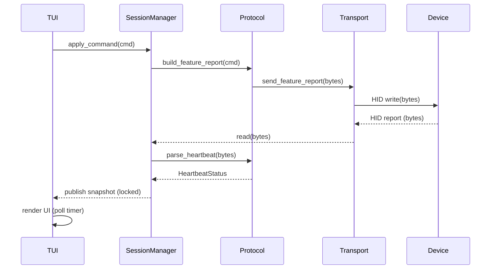

# incott-g23-v2-configurator

Cross-platform offline configurator for the Incott G23 V2 mouse.

This project started from protocol reverse engineering and now includes a production TUI application to read and configure mouse settings without the vendor web app.

## Introduction

The repository contains two tracks:

- Reverse engineering artifacts and protocol notes in `reverse-engineering/`.
- Production application code in `src/incott_configurator/`.

The goal is to provide a reliable, maintainable desktop configuration tool with real-time status updates and safe write commands.

## Technical Stack

### Language

- Python 3.12+

### UI

- Textual (terminal user interface)

### HID / Device Communication

- `hidapi` (Python bindings)

### Quality and Tooling

- `pytest` for tests
- `mypy` (strict type checking)
- `ruff` (linting)

### Packaging

- Python package via `pyproject.toml`
- Binary packaging with PyInstaller (recommended)

## Project Architecture

The production app is layered for maintainability:

- `src/incott_configurator/domain/`
: typed models, enums, and validation logic.
- `src/incott_configurator/protocol/`
: HID packet parsing and command builders.
- `src/incott_configurator/transport/`
: transport abstraction and hidapi adapter.
- `src/incott_configurator/service/`
: session loop, command queue, local settings persistence.
- `src/incott_configurator/app/`
: Textual TUI screens/widgets.
- `tests/`
: unit tests for parsing, encoding, and validation.

## Implemented Features

### Real-Time Monitoring

- Live heartbeat parsing (Report ID `0x09`).
- Always-visible current settings panel.
- Connection mode detection (wired/wireless).
- Battery, active slot, DPI X/Y, polling, debounce, motion sync display.

### Configuration Commands

- Active slot switching.
- Per-slot DPI customization.
- Polling rate configuration.
- Debounce configuration.
- LOD configuration.
- Sleep timeout configuration.

### Persistence and UX Behavior

- Local persistence for slot DPI values, LOD, and sleep timeout.
- Pending/dirty UI state to avoid refresh overwriting unsaved selections.
- Sync request dispatch after writes to refresh current settings quickly.

## Install and Run

### 1. Create and activate a virtual environment

```bash
python3 -m venv .venv
source .venv/bin/activate
```

### 2. Install the app with dev dependencies

```bash
pip install -e .[dev]
```

### 3. Run tests and checks (recommended)

```bash
pytest
mypy src
ruff check src tests
```

### 4. Start the app

```bash
incott-configurator
```

Alternative:

```bash
python -m incott_configurator.main
```

## Build a Binary

### Install PyInstaller

```bash
pip install pyinstaller
```

### Build

```bash
pyinstaller \
  --name incott-configurator \
  --onefile \
  --collect-all textual \
  --hidden-import hid \
  -m incott_configurator.main
```

Output binary is created in `dist/`.

## Distribution Notes

### Linux

- Distribute the binary from `dist/incott-configurator`.
- Users may need udev permissions for hidraw access.

### macOS

- Build on macOS to get a native binary.
- For public distribution, codesign and notarize the binary/app.

### Windows

- Build on Windows to get a native `.exe`.
- Ship `dist/incott-configurator.exe`.
- Code signing is recommended for trust and SmartScreen behavior.

## Current Scope and Limitations

- Reverse engineering is still evolving for undocumented features (for example performance modes).
- Documented protocol paths are implemented; future protocol discoveries will be integrated incrementally.

## Notes

- Reverse-engineering scripts are reference/test-vector material only.
- Production code does not import runtime logic from reverse-engineering scripts.

## Software Architecture

Overview

- This application follows a small, layered architecture focused on separation of concerns and testability. The main runtime pieces are:
  - `main` — application entrypoint that wires the transport, session manager, and TUI.
  - `transport` — platform-specific device access (hidapi adapter).
  - `service` — session manager: device discovery, read loop, command queue, and snapshot of device state.
  - `protocol` — packet builders/parsers for feature reports and heartbeat decoding.
  - `domain` — typed models and validation logic used across layers.
  - `app` — Textual TUI that renders `SessionManager` snapshots and enqueues write commands.

Packages and responsibilities

- `src/incott_configurator/main.py` — Boots the app: constructs `HidApiAdapter`, `SessionManager`, and `IncottConfiguratorApp`, starts the session background thread, and runs the TUI.
- `src/incott_configurator/transport/` — Transport abstraction and concrete adapters. The production adapter is `hidapi_adapter.py` which encapsulates `hid` usage and exposes a minimal `HidTransport` API (`find_management_device`, `open`, `read`, `send_feature_report`, `close`). Keep this layer thin so tests can inject fakes.
- `src/incott_configurator/service/session.py` — Central coordination component. Responsibilities:
  - Device discovery and lifecycle (open/close).
  - Background read loop (daemon thread) which reads packets, parses heartbeats, and maintains an `AppSnapshot`.
  - A simple, thread-safe command queue (`apply_command`) used by the UI to enqueue write requests.
  - Periodic sync requests to refresh device state.
- `src/incott_configurator/protocol/` — Encoders/decoders for feature reports and heartbeat parsing. Use these functions to build write commands and to interpret incoming packets into `domain` models.
- `src/incott_configurator/domain/` — Immutable dataclasses and enums (e.g. `HeartbeatStatus`, `AppSnapshot`, `PollingRate`) and validation helpers. The domain layer is the translation boundary between raw bytes and app semantics.
- `src/incott_configurator/app/` — Textual UI. It polls `SessionManager.snapshot()` on a timer (UI thread) and updates widgets. User actions call `SessionManager.apply_command()` with protocol-built feature reports.

Runtime flow (high level)

1. `main` constructs `HidApiAdapter` and `SessionManager`, then starts the session thread.
2. `SessionManager._run` discovers the device and opens the transport.
3. The session thread repeatedly:
   - Drains the command queue and sends feature reports via `transport.send_feature_report()`.
   - Periodically sends a sync request (`build_sync_request()`) to elicit a heartbeat.
   - Reads incoming packets with `transport.read()` and, if valid, parses heartbeats into a `HeartbeatStatus` which is stored in an `AppSnapshot` guarded by a lock.
4. The TUI runs on the main thread and periodically calls `SessionManager.snapshot()` to get the latest snapshot and render UI state. User interactions enqueue write commands and may persist local preferences.

Concurrency and error handling

- The session uses a dedicated daemon thread so the TUI remains responsive. Inter-thread communication is intentionally simple:
  - Commands: `queue.SimpleQueue` (non-blocking puts by UI, drained by session thread).
  - Snapshot: protected by a `threading.Lock` to return a consistent `AppSnapshot` to the UI.
- Transport-level errors and parse errors are logged; malformed packets are ignored to keep the session alive. On unrecoverable errors the session sets an error snapshot and closes the transport.

Design choices and rationale

- Thin transport adapter: keeps `SessionManager` and protocol code testable by isolating `hid` usage.
- Queue-based write model: avoids blocking the UI while writes are performed by the session thread.
- Heartbeat-driven state: the device is the source of truth for most runtime state, UI shows local cached values for settings that are persisted locally until device confirmation.
- Explicit validation in `domain.validation`: prevents generating invalid reports and surfaces helpful errors to the UI.

Extensibility and contribution notes

- Adding new commands: implement encoders in `src/incott_configurator/protocol/commands.py`, add validation helpers in `src/incott_configurator/domain/validation.py`, and expose required UI controls in `src/incott_configurator/app/tui.py`.
- Adding a transport: subclass `HidTransport` and implement the minimal API. Tests should inject the transport into `SessionManager` to simulate devices.
- Tests: unit tests live in `tests/` and focus on protocol encoders/parsers, session behavior, and UI hydration. Keep network/device I/O out of unit tests by mocking the transport.

Where to look first when contributing

- Device I/O and session management: [src/incott_configurator/service/session.py](src/incott_configurator/service/session.py#L1-L200)
- Transport adapter (hidapi): [src/incott_configurator/transport/hidapi_adapter.py](src/incott_configurator/transport/hidapi_adapter.py#L1-L200)
- Protocol encoders: [src/incott_configurator/protocol/commands.py](src/incott_configurator/protocol/commands.py#L1-L200)
- Heartbeat parsing: [src/incott_configurator/protocol/heartbeat.py](src/incott_configurator/protocol/heartbeat.py#L1-L200)
- TUI interactions and state hydration: [src/incott_configurator/app/tui.py](src/incott_configurator/app/tui.py#L1-L200)

**Sequence Diagram**

Notes:
- The session thread performs all blocking I/O and applies queued commands.
- The TUI only calls `SessionManager.apply_command()` and `SessionManager.snapshot()`.
- `Protocol` functions (encoders/parsers) convert between bytes and `domain` models.
```
